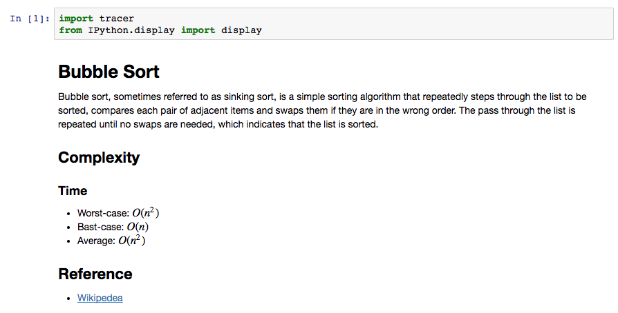
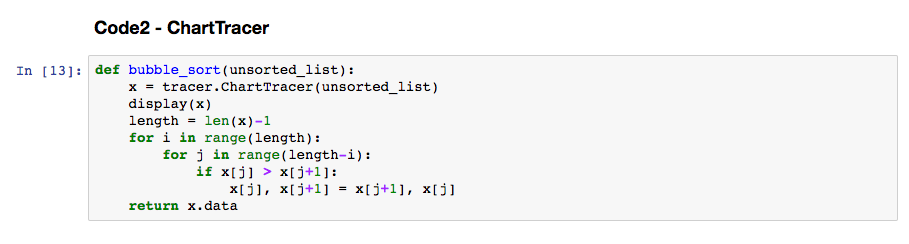
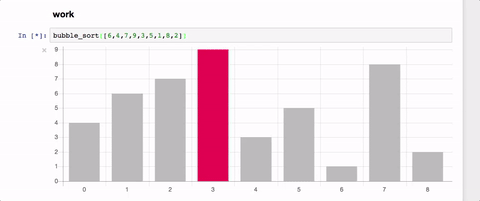

# tracer


Algorithm Visualizer for Jupyter/IPython Notebook.

You can see how your Python code works.

If you use the `display(TracerObject)` code from where you want to see, you can use it without any special modification.

Supports built-in list methods.

# Development Status
Pre-Alpha

# Todo
- Add more tracer api

# Installation
Requirement
- Jupyter/IPython Notebook

```console
$ git clone https://github.com/sn0wle0pard/tracer.git
$ cd tracer
$ pip install -e .
$ jupyter nbextension install --py --symlink --sys-prefix tracer
$ jupyter nbextension enable --py --sys-prefix tracer
```
# Demo







You can see [here](https://github.com/sn0wle0pard/tracer/tree/master/example)

ThirdParty Libraries
-----
* Chart.js - https://ipython.org
* Ipython - https://ipython.org
* ipywidgets - https://ipywidgets.readthedocs.io
* Jupyter notebook extensions - http://jupyter-contrib-nbextensions.readthedocs.io
* Underscore - http://underscorejs.org
* Webpack - https://webpack.github.io


Author
------

Han Lee / [@sn0wle0pard](https://github.com/sn0wle0pard)
