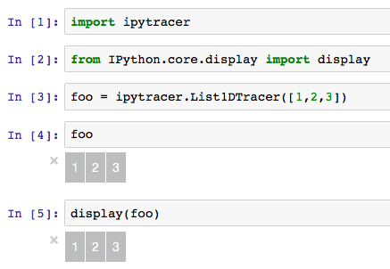
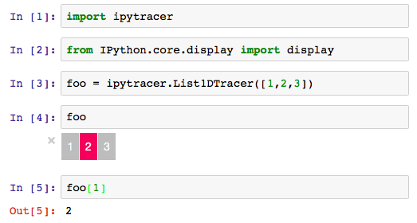
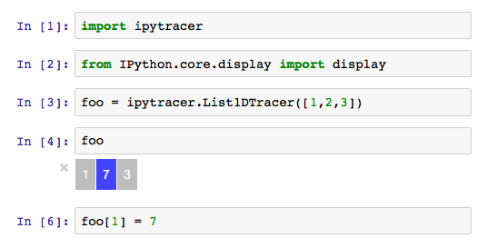
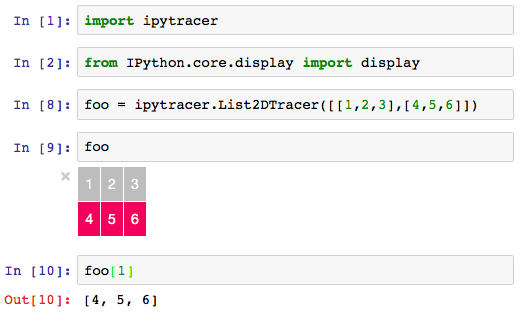
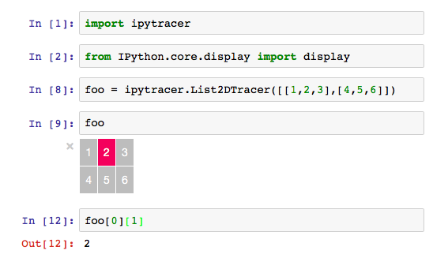
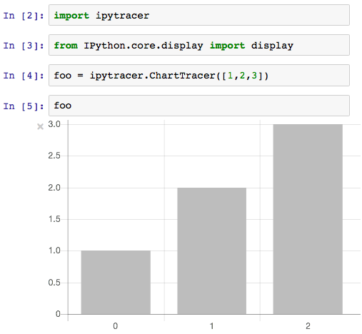
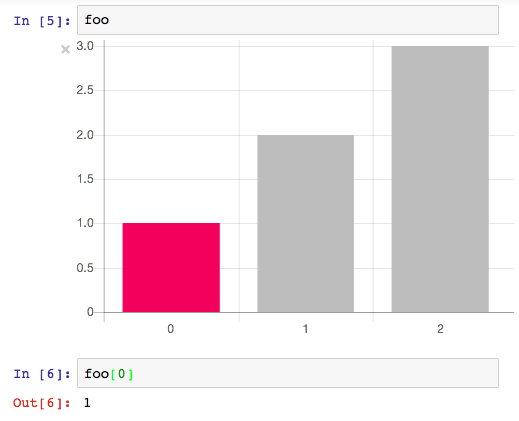
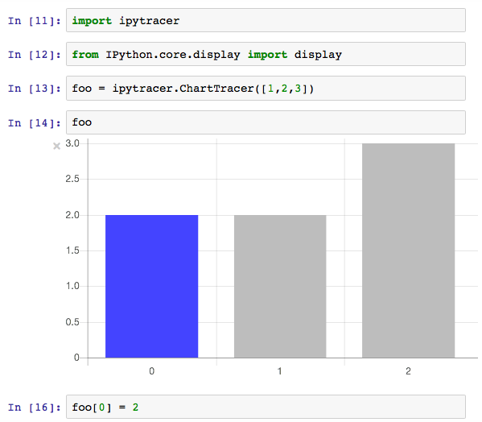

# ipytracer

> Algorithm Visualizer for Jupyter/IPython Notebook

> Inspired by parkjs814's [AlgorithmVisualizer](https://github.com/parkjs814/AlgorithmVisualizer).

Master | Latest(0.2.2)
-------|-------
[![tv-master-img][]][tv-site]|[![tv-latest-img][]][tv-site]

[tv-master-img]: https://travis-ci.org/sn0wle0pard/ipytracer.svg?branch=master
[tv-latest-img]: https://travis-ci.org/sn0wle0pard/ipytracer.svg?branch=latest
[tv-site]: https://travis-ci.org/sn0wle0pard/ipytracer


Algorithm Visualizer for Jupyter/IPython Notebook.

It was inspired by parkjs814's [AlgorithmVisualizer](https://github.com/parkjs814/AlgorithmVisualizer).

You can see how your Python code works.

If you use the `display(TracerObject)` code from where you want to see, you can use it without any special modification.

Supports built-in list methods.

# Development Status
Pre-Alpha

# Todo
- Add more tracer api
- Support non-built-in data type in python

# Installation
Requirement
- Jupyter/IPython Notebook (Python3.x)

To install use pip:
```console
$ pip install ipytracer
$ jupyter nbextension enable --py --sys-prefix ipytracer
```

For a development installation (requires npm),

Pre installation
```console
$ npm install -g webpack
```
Installation
```console
$ git clone https://github.com/sn0wle0pard/ipytracer.git
$ cd ipytracer
$ pip install -e .
$ jupyter nbextension install --py --symlink --sys-prefix ipytracer
$ jupyter nbextension enable --py --sys-prefix ipytracer
```
# Demo
## Youtube Video
[](https://www.youtube.com/watch?v=vZQJ0Y3GtIs)

https://youtu.be/vZQJ0Y3GtIs

## Tracers
### List1DTracer

Display | Get Item | Set Item
--------|----------|---------
 |  | 

### List2DTracer

Get Item | Set Item
---------|---------
| 
| 
### ChartTracer

Display | Get Item | Set Item
--------|----------|---------
 |  | 
## Bubble Sort

```python
import ipytracer
from IPython.core.display import display

def bubble_sort(unsorted_list):
    x = ipytracer.ChartTracer(unsorted_list)
    display(x)
    length = len(x)-1
    for i in range(length):
        for j in range(length-i):
            if x[j] > x[j+1]:
                x[j], x[j+1] = x[j+1], x[j]
    return x.tolist()

bubble_sort([6,4,7,9,3,5,1,8,2])
```


You can see more example [here](https://github.com/sn0wle0pard/tracer/tree/master/example)

Third Party Libraries
-----
* Chart.js - http://www.chartjs.org
* IPython - https://ipython.org
* ipywidgets - https://ipywidgets.readthedocs.io
* traitlets - https://traitlets.readthedocs.io/
* Underscore - http://underscorejs.org
* Webpack - https://webpack.github.io

See Also [NOTICE.md](NOTICE.md)

Author
------

Han Lee / [@sn0wle0pard](https://github.com/sn0wle0pard)

License
-------
```
The Clear BSD License

Copyright (c) 2015-2017, Han Lee
All rights reserved.

Redistribution and use in source and binary forms, with or without
modification, are permitted (subject to the limitations in the disclaimer
below) provided that the following conditions are met:

* Redistributions of source code must retain the above copyright notice, this
  list of conditions and the following disclaimer.

* Redistributions in binary form must reproduce the above copyright notice,
  this list of conditions and the following disclaimer in the documentation
  and/or other materials provided with the distribution.

* Neither the name of the copyright holder nor the names of its contributors may be used
  to endorse or promote products derived from this software without specific
  prior written permission.

NO EXPRESS OR IMPLIED LICENSES TO ANY PARTY'S PATENT RIGHTS ARE GRANTED BY THIS
LICENSE. THIS SOFTWARE IS PROVIDED BY THE COPYRIGHT HOLDERS AND CONTRIBUTORS
"AS IS" AND ANY EXPRESS OR IMPLIED WARRANTIES, INCLUDING, BUT NOT LIMITED TO,
THE IMPLIED WARRANTIES OF MERCHANTABILITY AND FITNESS FOR A PARTICULAR PURPOSE
ARE DISCLAIMED. IN NO EVENT SHALL THE COPYRIGHT HOLDER OR CONTRIBUTORS BE
LIABLE FOR ANY DIRECT, INDIRECT, INCIDENTAL, SPECIAL, EXEMPLARY, OR
CONSEQUENTIAL DAMAGES (INCLUDING, BUT NOT LIMITED TO, PROCUREMENT OF SUBSTITUTE
GOODS OR SERVICES; LOSS OF USE, DATA, OR PROFITS; OR BUSINESS INTERRUPTION)
HOWEVER CAUSED AND ON ANY THEORY OF LIABILITY, WHETHER IN CONTRACT, STRICT
LIABILITY, OR TORT (INCLUDING NEGLIGENCE OR OTHERWISE) ARISING IN ANY WAY OUT
OF THE USE OF THIS SOFTWARE, EVEN IF ADVISED OF THE POSSIBILITY OF SUCH
DAMAGE.
```
